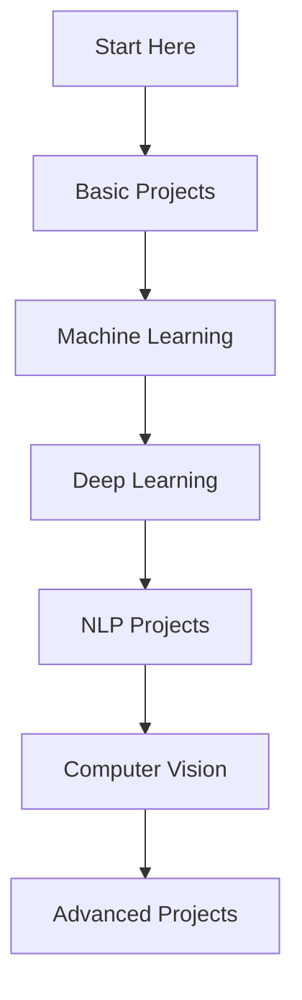

# 🚀 AI Projects Using Python - Complete Collection

<div align="center">
  
[](https://www.python.org/downloads/)
[](https://en.wikipedia.org/wiki/Artificial_intelligence)
[](https://en.wikipedia.org/wiki/Machine_learning)
[](https://github.com/Sudhu04/AI-Projects-Using-Python)
[](LICENSE)

### 🌟 A comprehensive collection of 30+ AI and Machine Learning projects using Python, perfect for beginners and intermediate developers!

</div>
--------------------------------------------------------------------------------------------------------------------------------------------------------------

## 🌟 Overview

Welcome to the **AI Projects Using Python** repository! This collection features **30+ carefully crafted AI and Machine Learning projects** designed to help you master artificial intelligence concepts through hands-on implementation. Each project includes complete source code, detailed explanations, and live demo capabilities.

### ✨ Key Features
- 🎯 **Beginner-Friendly** - Perfect for AI/ML newcomers
- 📚 **Educational** - Learn by building real-world applications
- 🚀 **Production-Ready** - Industry-standard code practices
- 📊 **Interactive** - Live demos with GitHub Sandbox
- 🔧 **Customizable** - Upload your own datasets
- 📱 **Diverse Applications** - From chatbots to computer vision

---

## 🎯 Project Categories

### 🤖 Machine Learning Projects
| Project Name | Description | Live Demo |
|--------------|-------------|-----------|
| **[📊 Credit Card Fraud Detection](Simple%20AI%20Projects/Credit%20Card%20Fraud%20Detection%20using%20Scikit-learn)** | Detect fraudulent transactions using ML algorithms | [](https://github.com/codespaces/new?repo=Sudhu04/AI-Projects-Using-Python&machine=basicLinux32gb&location=EastUs) |
| **[🏠 House Price Prediction](Simple%20AI%20Projects/Predict%20House%20Prices%20with%20Linear%20Regression)** | Predict real estate prices using Linear Regression | [](https://github.com/codespaces/new?repo=Sudhu04/AI-Projects-Using-Python&machine=basicLinux32gb&location=EastUs) |
| **[🚗 Car Price Prediction](Simple%20AI%20Projects/Predict%20Car%20Prices%20using%20Random%20Forest)** | Estimate vehicle prices with Random Forest | [](https://github.com/codespaces/new?repo=Sudhu04/AI-Projects-Using-Python&machine=basicLinux32gb&location=EastUs) |
| **[💔 Customer Churn Prediction](Simple%20AI%20Projects/Customer%20Churn%20Prediction%20using%20classification%20algorithms)** | Predict customer retention using classification | [](https://github.com/codespaces/new?repo=Sudhu04/AI-Projects-Using-Python&machine=basicLinux32gb&location=EastUs) |
| **[👥 Employee Attrition Prediction](Simple%20AI%20Projects/Predict%20Employee%20Attrition%20using%20XGBoost)** | Forecast employee turnover with XGBoost | [](https://github.com/codespaces/new?repo=Sudhu04/AI-Projects-Using-Python&machine=basicLinux32gb&location=EastUs) |
| **[🌸 Iris Flower Classification](Simple%20AI%20Projects/Iris%20Flower%20Classification%20using%20decision%20trees)** | Classic ML classification with decision trees | [](https://github.com/codespaces/new?repo=Sudhu04/AI-Projects-Using-Python&machine=basicLinux32gb&location=EastUs) |
| **[💎 Predict Diabetes](Simple%20AI%20Projects/Predict%20Diabetes%20using%20logistic%20regression)** | Medical prediction using logistic regression | [](https://github.com/codespaces/new?repo=Sudhu04/AI-Projects-Using-Python&machine=basicLinux32gb&location=EastUs) |
| **[🫀 Disease Prediction](Simple%20AI%20Projects/Disease%20Prediction%20(e.g.,%20Heart%20Disease)%20using%20ML%20algorithms)** | Predict diseases using ML algorithms | [](https://github.com/codespaces/new?repo=Sudhu04/AI-Projects-Using-Python&machine=basicLinux32gb&location=EastUs) |

### 🧠 Deep Learning & Neural Networks
| Project Name | Description | Live Demo |
|--------------|-------------|-----------|
| **[🧮 Basic Neural Network](Simple%20AI%20Projects/Basic%20Neural%20Network%20from%20scratch)** | Build NN from scratch without libraries | [](https://github.com/codespaces/new?repo=Sudhu04/AI-Projects-Using-Python&machine=basicLinux32gb&location=EastUs) |
| **[🔢 Handwritten Digit Recognition](Simple%20AI%20Projects/Handwritten%20Digit%20Recognition%20with%20MNIST%20dataset)** | CNN for MNIST digit classification | [](https://github.com/codespaces/new?repo=Sudhu04/AI-Projects-Using-Python&machine=basicLinux32gb&location=EastUs) |
| **[🐱🐶 Dog vs Cat Classifier](Simple%20AI%20Projects/Dog%20vs.%20Cat%20Classifier%20with%20CNN)** | Image classification with CNN | [](https://github.com/codespaces/new?repo=Sudhu04/AI-Projects-Using-Python&machine=basicLinux32gb&location=EastUs) |
| **[🖼️ Image Classifier](Simple%20AI%20Projects/Image%20Classifier%20using%20Keras%20and%20TensorFlow)** | General image classification system | [](https://github.com/codespaces/new?repo=Sudhu04/AI-Projects-Using-Python&machine=basicLinux32gb&location=EastUs) |

### 📊 Data Analysis & Prediction
| Project Name | Description | Live Demo |
|--------------|-------------|-----------|
| **[📈 Stock Price Prediction](Simple%20AI%20Projects/Stock%20Price%20Prediction%20using%20historical%20data%20with%20a%20simple%20Linear%20Regression)** | Financial forecasting with Linear Regression | [](https://github.com/codespaces/new?repo=Sudhu04/AI-Projects-Using-Python&machine=basicLinux32gb&location=EastUs) |
| **[🌦️ Weather Forecasting](Simple%20AI%20Projects/Weather%20Forecasting%20using%20historical%20data)** | Predict weather patterns from historical data | [](https://github.com/codespaces/new?repo=Sudhu04/AI-Projects-Using-Python&machine=basicLinux32gb&location=EastUs) |
| **[🎬 Movie Rating Prediction](Simple%20AI%20Projects/Movie%20Rating%20Prediction%20using%20Collaborative%20Filtering)** | Predict movie ratings using collaborative filtering | [](https://github.com/codespaces/new?repo=Sudhu04/AI-Projects-Using-Python&machine=basicLinux32gb&location=EastUs) |

### 🎮 AI Gaming & Strategy
| Project Name | Description | Live Demo |
|--------------|-------------|-----------|
| **[❌⭕ Tic-Tac-Toe AI](Simple%20AI%20Projects/Tic-Tac-Toe%20AI%20using%20Minimax%20Algorithm)** | Unbeatable Tic-Tac-Toe using Minimax | [](https://github.com/codespaces/new?repo=Sudhu04/AI-Projects-Using-Python&machine=basicLinux32gb&location=EastUs) |
| **[🧮 Basic Calculator](Simple%20AI%20Projects/Basic%20Calculator%20Using%20Python)** | Simple calculator with AI enhancements | [](https://github.com/codespaces/new?repo=Sudhu04/AI-Projects-Using-Python&machine=basicLinux32gb&location=EastUs) |

### 💬 Natural Language Processing
| Project Name | Description | Live Demo |
|--------------|-------------|-----------|
| **[🤖 Simple Chatbot](Simple%20AI%20Projects/Simple%20Chatbot%20using%20predefined%20responses)** | Rule-based conversational AI | [](https://github.com/codespaces/new?repo=Sudhu04/AI-Projects-Using-Python&machine=basicLinux32gb&location=EastUs) |
| **[📝 Sentiment Analysis](Simple%20AI%20Projects/Sentiment%20Analysis%20on%20text%20data%20using%20NLTK)** | Analyze text sentiment using NLTK | [](https://github.com/codespaces/new?repo=Sudhu04/AI-Projects-Using-Python&machine=basicLinux32gb&location=EastUs) |
| **[📧 Spam Email Detector](Simple%20AI%20Projects/Spam%20Email%20Detector%20using%20Scikit-learn)** | Filter spam using ML techniques | [](https://github.com/codespaces/new?repo=Sudhu04/AI-Projects-Using-Python&machine=basicLinux32gb&location=EastUs) |
| **[🎭 Emotion Detection](Simple%20AI%20Projects/Detect%20Emotion%20in%20Text%20using%20Natural%20Language%20Toolkit%20(NLTK))** | Identify emotions in text | [](https://github.com/codespaces/new?repo=Sudhu04/AI-Projects-Using-Python&machine=basicLinux32gb&location=EastUs) |
| **[📰 Fake News Detection](Simple%20AI%20Projects/Identify%20Fake%20News%20using%20Naive%20Bayes)** | Identify misinformation using Naive Bayes | [](https://github.com/codespaces/new?repo=Sudhu04/AI-Projects-Using-Python&machine=basicLinux32gb&location=EastUs) |
| **[📝 Text Summarizer](Simple%20AI%20Projects/Text%20Summarizer%20using%20NLTK)** | Automatic text summarization | [](https://github.com/codespaces/new?repo=Sudhu04/AI-Projects-Using-Python&machine=basicLinux32gb&location=EastUs) |
| **[🏷️ Named Entity Recognition](Simple%20AI%20Projects/Named%20Entity%20Recognition%20(NER)%20using%20spaCy)** | Extract entities from text using spaCy | [](https://github.com/codespaces/new?repo=Sudhu04/AI-Projects-Using-Python&machine=basicLinux32gb&location=EastUs) |
| **[⭐ Fake Product Review Detection](Simple%20AI%20Projects/Fake%20Product%20Review%20Detection%20using%20NLP%20techniques)** | Spot fake reviews using NLP | [](https://github.com/codespaces/new?repo=Sudhu04/AI-Projects-Using-Python&machine=basicLinux32gb&location=EastUs) |
| **[📝 Automatic Essay Grading](Simple%20AI%20Projects/Automatic%20Essay%20Grading%20using%20BERT)** | Grade essays automatically using BERT | [](https://github.com/codespaces/new?repo=Sudhu04/AI-Projects-Using-Python&machine=basicLinux32gb&location=EastUs) |

### 🎬 Recommendation Systems
| Project Name | Description | Live Demo |
|--------------|-------------|-----------|
| **[🎥 Movie Recommendation](Simple%20AI%20Projects/Movie%20Recommendation%20System%20using%20cosine%20similarity)** | Content-based movie recommendations | [](https://github.com/codespaces/new?repo=Sudhu04/AI-Projects-Using-Python&machine=basicLinux32gb&location=EastUs) |
| **[📚 Book Recommendation](Simple%20AI%20Projects/Book%20Recommendation%20System%20using%20collaborative%20filtering)** | Collaborative filtering for books | [](https://github.com/codespaces/new?repo=Sudhu04/AI-Projects-Using-Python&machine=basicLinux32gb&location=EastUs) |

### 🎯 Specialized AI Applications
| Project Name | Description | Live Demo |
|--------------|-------------|-----------|
| **[🎤 Personal Assistant](Simple%20AI%20Projects/Simple%20Personal%20Assistant%20using%20Python%20speech%20libraries)** | Voice-controlled AI assistant | [](https://github.com/codespaces/new?repo=Sudhu04/AI-Projects-Using-Python&machine=basicLinux32gb&location=EastUs) |
| **[📄 Resume Scanner](Simple%20AI%20Projects/Create%20a%20Resume%20Scanner%20using%20keyword%20extraction)** | Scan resumes with keyword extraction | [](https://github.com/codespaces/new?repo=Sudhu04/AI-Projects-Using-Python&machine=basicLinux32gb&location=EastUs) |

---

## 📊 Custom Data Upload Feature

### 🔄 Upload Your Own Database!

Many projects in this repository support **custom dataset uploads**. You can replace the default datasets with your own data to see how the models perform on your specific use cases.

#### 📋 Projects Supporting Custom Data Upload:
- **📊 Credit Card Fraud Detection** - Upload your transaction data
- **🏠 House Price Prediction** - Use your real estate dataset
- **🚗 Car Price Prediction** - Import your vehicle database
- **💔 Customer Churn Prediction** - Upload customer data
- **👥 Employee Attrition Prediction** - Use HR datasets
- **💎 Predict Diabetes** - Medical datasets
- **🫀 Disease Prediction** - Healthcare data
- **📈 Stock Price Prediction** - Financial datasets
- **🌦️ Weather Forecasting** - Meteorological data
- **🎬 Movie Rating Prediction** - Entertainment datasets

#### 📤 How to Upload Custom Data:
1. **Prepare your CSV file** with appropriate columns
2. **Replace the default dataset** in the project folder
3. **Update column names** in the code if needed
4. **Run the project** with your custom data!

---

## 🛠️ Installation & Setup

### 📋 Prerequisites
- Python 3.7 or higher
- pip package manager
- Git

### 🔧 Quick Setup

```bash
# Clone the repository
git clone https://github.com/Sudhu04/AI-Projects-Using-Python.git
cd AI-Projects-Using-Python

# Create virtual environment
python -m venv ai-env
source ai-env/bin/activate  # On Windows: ai-env\Scripts\activate

# Install common dependencies
pip install -r requirements.txt

# If requirements.txt doesn't exist, install key packages:
pip install numpy pandas scikit-learn matplotlib seaborn tensorflow keras nltk spacy opencv-python
```

### 📦 Required Libraries
```python
# Core ML/DL Libraries
numpy, pandas, scikit-learn, tensorflow, keras, pytorch

# NLP Libraries
nltk, spacy, textblob, wordcloud

# Computer Vision
opencv-python, pillow, matplotlib

# Data Visualization
matplotlib, seaborn, plotly

# Web & API
flask, django, streamlit, fastapi

# Additional Tools
jupyter, notebook, spyder
```

---

## 🎯 Getting Started

### 🚀 Quick Start Guide
1. **Choose a project** from the categories above
2. **Click the GitHub Sandbox link** to open in browser
3. **Run the code** directly in your browser
4. **Experiment** with parameters and datasets
5. **Learn** by modifying and improving the code

### 📚 Learning Path


---

## 🧠 Technologies Used

<div align="center">
  
### 🤖 Machine Learning


### 🧠 Deep Learning


### 📊 Data Science


### 💬 Natural Language Processing


### 🖼️ Computer Vision


</div>

---

## 📈 Project Complexity Levels

### 🟢 Beginner Level
- Basic Calculator Using Python
- Simple Chatbot using predefined responses
- Iris Flower Classification using decision trees
- Predict House Prices with Linear Regression
- Handwritten Digit Recognition with MNIST dataset

### 🟡 Intermediate Level
- Credit Card Fraud Detection using Scikit-learn
- Stock Price Prediction using historical data
- Sentiment Analysis on text data using NLTK
- Dog vs. Cat Classifier with CNN
- Movie Recommendation System using cosine similarity

### 🔴 Advanced Level
- Automatic Essay Grading using BERT
- Named Entity Recognition (NER) using spaCy
- Fake Product Review Detection using NLP techniques
- Disease Prediction using ML algorithms
- Simple Personal Assistant using Python speech libraries

---

## 🎮 Interactive Features

### 🔥 GitHub Sandbox Integration
Every project includes a **GitHub Sandbox** link that allows you to:
- ✅ **Run code instantly** in your browser
- ✅ **No local setup required**
- ✅ **Full development environment**
- ✅ **Collaborative coding**
- ✅ **Auto-save functionality**

### 📊 Live Demos
Experience AI in action with live demonstrations:
- **Real-time predictions**
- **Interactive visualizations**
- **Parameter tuning**
- **Model comparisons**
- **Performance metrics**

---

## 📚 Documentation & Resources

### 📖 Project Documentation
Each project includes:
- **Detailed README** with setup instructions
- **Code comments** explaining key concepts
- **Sample datasets** for immediate testing
- **Performance metrics** and evaluation
- **Extension ideas** for further learning

### 🎓 Learning Resources
- **[Python Basics](https://www.python.org/about/gettingstarted/)** - Python fundamentals
- **[Machine Learning Course](https://www.coursera.org/learn/machine-learning)** - Andrew Ng's ML course
- **[Deep Learning Specialization](https://www.coursera.org/specializations/deep-learning)** - Deep learning fundamentals
- **[Kaggle Learn](https://www.kaggle.com/learn)** - Hands-on ML courses
- **[Fast.ai](https://www.fast.ai/)** - Practical deep learning

---

## 🤝 Contributing

We welcome contributions from the community! Here's how you can help:

### 🎯 Ways to Contribute
- **🐛 Report bugs** - Create an issue for any bugs found
- **💡 Suggest features** - Propose new project ideas
- **📝 Improve documentation** - Enhance README files
- **🎨 Add visualizations** - Create better charts and graphs
- **🚀 Optimize code** - Improve performance and efficiency
- **📊 Add datasets** - Contribute new datasets for projects

### 📋 Contribution Guidelines
1. Fork the repository
2. Create a feature branch (`git checkout -b feature/AmazingFeature`)
3. Commit your changes (`git commit -m 'Add some AmazingFeature'`)
4. Push to the branch (`git push origin feature/AmazingFeature`)
5. Open a Pull Request

---

## 🐛 Bug Reports & Support

### 🚨 Bug Report Template
```markdown
**Bug Description:**
A clear description of the bug

**Steps to Reproduce:**
1. Step one
2. Step two
3. Step three

**Expected Behavior:**
What you expected to happen

**Actual Behavior:**
What actually happened

**Environment:**
- OS: [e.g., Windows 10]
- Python Version: [e.g., 3.8.5]
- Browser: [if applicable]

**Screenshots:**
If applicable, add screenshots
```

### 💬 Support Channels
- **📧 Email:** sudhanva486@gmail.com
- **💬 GitHub Issues:** [Create an issue](https://github.com/Sudhu04/AI-Projects-Using-Python/issues)

---

## 🙏 Acknowledgments

### 🌟 Special Thanks To:
- **🤖 TensorFlow Team** - For amazing deep learning frameworks
- **📊 Scikit-learn Community** - For comprehensive ML tools
- **💬 NLTK & spaCy Teams** - For NLP capabilities
- **🖼️ OpenCV Community** - For computer vision tools
- **📈 Kaggle** - For datasets and learning platform
- **💻 GitHub** - For providing this amazing platform

### 📚 Datasets & Resources:
- **[Kaggle Datasets](https://www.kaggle.com/datasets)** - Primary data source
- **[UCI Machine Learning Repository](https://archive.ics.uci.edu/ml/index.php)** - Academic datasets
- **[Google Dataset Search](https://datasetsearch.research.google.com/)** - Dataset discovery
- **[AWS Public Datasets](https://registry.opendata.aws/)** - Cloud datasets
- **[Government Open Data](https://www.data.gov/)** - Public sector data

---

## 📜 License

This project is licensed under the **MIT License** - see the [LICENSE](LICENSE) file for details.

### 📄 License Summary:
- ✅ **Commercial use** allowed
- ✅ **Modification** permitted
- ✅ **Distribution** encouraged
- ✅ **Private use** approved
- ⚠️ **Attribution required**

---

## ⭐ Support the Project

If you find this repository helpful, please consider:

### 🌟 Star the Repository
```bash
# Show your support by starring ⭐ the repo!
https://github.com/Sudhu04/AI-Projects-Using-Python
```

### 🍴 Fork & Share
```bash
# Fork the repository and share with others!
https://github.com/Sudhu04/AI-Projects-Using-Python/fork
```

### 📢 Spread the Word
Share this repository with your network:
- **Twitter:** `Amazing AI Projects collection using Python! 🐍🤖 Check it out:`
- **LinkedIn:** `Just discovered this incredible AI projects repository...`
- **Facebook:** `Learning AI/ML? Check out these 30+ Python projects!`

---

## 🚀 What's Next?

### 🎯 Upcoming Projects
- **[🎮 Game Playing AI]** - Reinforcement learning games
- **[🚗 Self-Driving Car Simulation]** - Autonomous vehicle AI
- **[🎨 AI Art Generator]** - Creative AI applications
- **[🎵 Music Generation]** - AI composer
- **[🤖 Advanced Chatbot]** - GPT-powered conversations

### 📅 Release Schedule
- **🔥 New projects added monthly**
- **📊 Dataset updates weekly**
- **🐛 Bug fixes continuously**
- **🚀 Major updates quarterly**

---

<div align="center">

### 🌟 **Don't forget to star ⭐ the repository if you found it helpful!**

### 🔄 **Keep learning, keep building, keep innovating!**

**[⬆ Back to Top](#-ai-projects-using-python---complete-collection)**

</div>

---

<div align="center">

**Made with ❤️ by [Sudhanva M S](https://github.com/Sudhu04)**

**© 2025 AI Projects Using Python. All rights reserved.**

</div>
